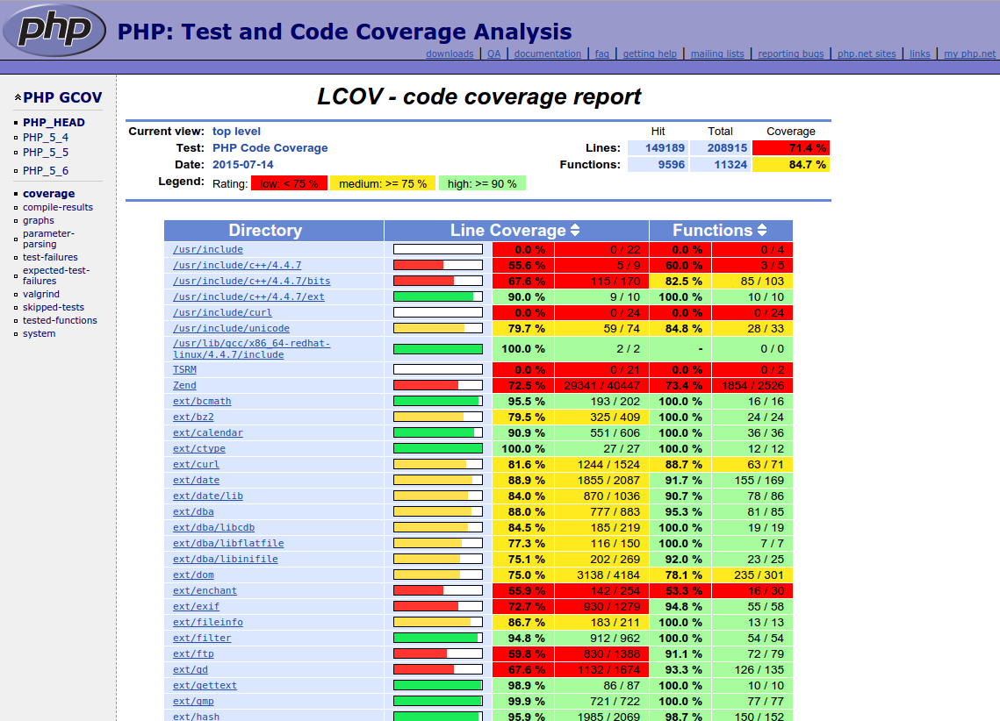

PHPTestFest - Virtual Machine
=============================

Essa máquina virutal utiliza uma imagem já provisionada, para ser utilizada nos eventos sem a necessidade de acesso à internet para fazer o provisionamento.

A idéia é levar essa VM montada em pendrives com a vm box baixada, para facilitar o "mão na massa" nos eventos.

## Começando

Clone o repositório e inicie o submódulo

```bash
$ git clone https://github.com/PHPTestFestBrasil/vagrant-phptt-provisioned.git
```

```bash
$ cd vagrant-phptt-provisioned
```

```bash
$ ./start
```

Pronto! Após alguns segundos, a máquina virtual estará completamente montada para utilização.

## Requisitos
 - [VirtualBox](https://www.virtualbox.org/wiki/Downloads)
 - [VirtualBox Oracle VM VirtualBox Extension Pack](https://www.virtualbox.org/wiki/Downloads)
 - [Vagrant](http://www.vagrantup.com/downloads.html)

### Preparação do ambiente vagrant

Inicie a máquina virtual com o Vagrant

```bash
$ vagrant plugin install vagrant-vbguest
```

```bash
$ vagrant plugin install vagrant-cachier
```

```bash
$ vagrant plugin install vagrant-rsync-back
```

```bash
$ vagrant plugin install vagrant-timezone
```

- **opcional**: baixar a *box* antes da primeira execução da VM (ex: pré-PHPTestFest). Normalmente não necessário porque ao iniciar a VM a box será baixada se não existir e, principalmente, se houver uma atualização de versão da box.

```bash
$ vagrant box add phptestfest/base.box
```

### Iniciar e acessar a VM

```bash
$ vagrant up
```

```bash
$ vagrant ssh
```

## Compilando o PHP e rodando os testes

Compile o PHP com os comandos abaixo:

```bash
$ cd php-src
```

```bash
$ ./buildconf
```

```bash
$ ./configure \
    --enable-gcov \
    --enable-debug \
    --enable-sigchild \
    --enable-libgcc \
    --with-openssl \
    --with-kerberos \
    --with-pcre-regex \
    --enable-bcmath \
    --with-bz2 \
    --enable-calendar \
    --with-curl \
    --with-enchant \
    --enable-exif \
    --enable-ftp \
    --with-gd \
    --enable-gd-jis-conv \
    --with-gettext \
    --with-mhash \
    --with-kerberos \
    --with-imap-ssl \
    --enable-intl \
    --enable-mbstring \
    --with-onig \
    --with-pspell \
    --with-recode \
    --with-mm \
    --enable-shmop \
    --with-snmp \
    --enable-soap \
    --enable-sockets \
    --enable-sysvsem \
    --enable-wddx \
    --with-xmlrpc \
    --with-xsl \
    --enable-zip \
    --with-zlib \
    --with-readline \
    --with-libedit
```

```bash
$ make
```

E então execute os testes com o comando abaixo:

```bash
$ make test
```

No final do processo (que demora alguns minutos), responda com Y para que o resultado dos testes seja enviado para o site do PHPQA.

## Gerando LCOV code coverage report

Siga os próximos passos para gerar um relatório de cobertura de código como o
abaixo:



Rode os seguintes comandos:

```bash
$ ./configure --enable-gcov # configura o php habilitando essa biblioteca
```

```bash
$ make
```

Para gerar um relatório de cobertura de um teste, é necessário executar o comando

```bash
$ make lcov TESTS=teste/a/ser/executado  ; xdg-open lcov_html/index.html
```

O relatório em HTML fica disponível em lcov_html/index.html. Assim, é só comparar
o seu relatório de cobertura com o [relatório do PHP QA](http://gcov.php.net/PHP_HEAD/lcov_html/index.php)
para ver se o seu teste testou algo que não era testado antes.

## Testando
```bash
$ make test TESTS=diretorio/
```

```bash
$ make test TESTS=diretorio/*.phpt
```

```bash
$ make test TESTS=diretorio/nome_teste.phpt
```

## Slides

 - [PHPT - Ivan Rosolen (PHPSP)](http://pt.slideshare.net/ivanrosolen/phpt-13829359)
 - [Escrevendo testes com PHPT e contribuindo com o PHP - Rafael Dohms](http://blog.doh.ms/2009/08/19/escrevendo-testes-com-phpt/?lang=pt-br)
 - [PHPSP TestFest 2010 - Rafael Dohms](http://pt.slideshare.net/rdohms/phpsp-testfest-2010)
 - [Writing Tests for PHP Source - php[tek] 2017 - Sammy Kaye Powers](https://speakerdeck.com/sammyk/writing-tests-for-php-source-php-tek-2017)

## Fontes para geração desse repositório:

 - [https://gist.github.com/rogeriopradoj/68f4372483814cba62d5](https://gist.github.com/rogeriopradoj/68f4372483814cba62d5)
 - [https://github.com/mauriciovieira/PHPTestFest](https://github.com/mauriciovieira/PHPTestFest)
